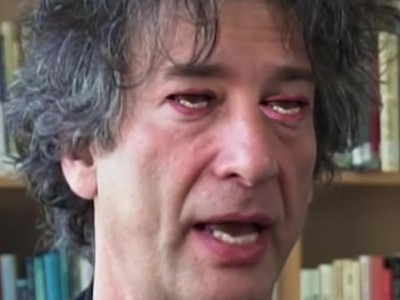

# Corinthian Filter

**Pipeline:**

Download a video, convert it into frames, find landmarks

    youtube-dl https://www.youtube.com/watch?v=cVW6jBbD5Q8`
    python extract_frames.py cVW6jBbD5Q8
    python find_landmarks.py cVW6jBbD5Q8

Begin the nightmare

    python corinthian.py cVW6jBbD5Q8

Developer notes:

How to build a video: Open Kdenlive, import frames as slideshow with 1 image per frame duration. Open org. audio track. Duplicate the audio track twice. Set left/right for each voice and add AM pitchshifter / Multivoice Chrous. Offset tracks by a few milliseconds. Add low ambient hum for evil noise?