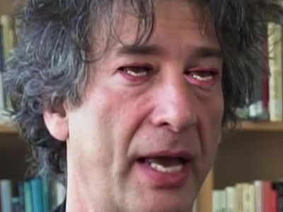

# Corinthian Filter

Watch it in action: https://youtu.be/JPhnuYbPG1s

With everything installed (good luck on that!), change the target in the Makefile to a valid youtube-URI and run `make corinthian`

#### Developer Notes:

Version 0.2

If it's very slow, check that dlib uses CUDA properly.

+ [ ] Even using a CNN over a HOG, sometimes an obvious face isn't found (upsample?)
+ [ ] Motion stabilization with low-rank PCA over time-series should be possible